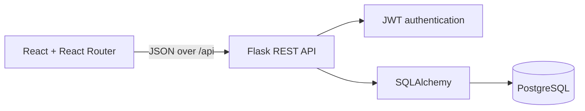

# Hackaform — Event Planning, Without the Chaos

[](https://github.com/Svnd3/hackaform/actions/workflows/ci.yml)

Hackaform is a full-stack event productivity platform for people who organize and attend hackathons, workshops, meetups, and community events. Visitors can discover opportunities, attendees can keep bookings in one schedule, and organizers can publish events, build agendas, monitor capacity, and review attendance from one workspace.

Phase 2 extends the original React discovery prototype instead of replacing it. Public event feeds have been replaced by a custom Flask REST API and PostgreSQL database, with persistent relational data, authentication, ownership authorization, and complete CRUD workflows.

## Why Hackaform exists

Useful Kenyan and East African events are often scattered across websites and group chats. Attendees lose time comparing incomplete posts and tracking plans manually; organizers repeat event details across tools and manage attendance in spreadsheets. Hackaform turns that fragmented process into a dependable flow:

1. Discover a relevant event.
2. Review its programme and remaining capacity.
3. Book one or more places.
4. Manage the booking from a personal schedule.
5. Create and operate an event from the organizer studio.

## Phase 2 features

### Attendee experience

- Browse and search published events by keyword, category, location, date, and format.
- View event details, availability, organizer information, and an ordered agenda.
- Register, sign in, and restore a session with a bearer JWT.
- Create, read, update, and delete personal bookings.
- Keep persistent bookings in **My schedule**.
- Save a separate browser-local shortlist before deciding to book.

### Organizer experience

- Create, read, update, publish, cancel, and delete owned events.
- Create, read, update, reorder, and delete related agenda items.
- Review attendee names, statuses, quantities, and confirmed capacity.
- Manage draft and cancelled listings privately.
- Receive clear validation, authorization, conflict, loading, empty, and error feedback.

### Data integrity and security

- Passwords are hashed and never returned by the API.
- Protected requests use `Authorization: Bearer <access_token>`.
- The API, not only the UI, enforces event and booking ownership.
- Database constraints prevent duplicate user/event bookings and invalid quantities.
- PostgreSQL row locking and server-side checks protect event capacity.
- Agenda times must remain inside their parent event.
- Structured JSON errors provide stable codes, readable messages, and field details.

## Architecture



The relational model is:

- A **User** owns many **Events**.
- An **Event** contains many **AgendaItems**.
- A **User** makes many **Bookings**.
- A **Booking** belongs to one User and one Event.

See the complete [ERD and integrity rules](docs/ERD.md) and the [Phase 2 pitch](docs/PHASE2_PITCH.md).

## Technology

| Layer | Tools |
| --- | --- |
| Client | React 19, React Router, Vite, JavaScript, CSS, Lucide icons |
| API | Flask, Flask-SQLAlchemy, Flask-Migrate, Flask-JWT-Extended, Flask-CORS |
| Data | PostgreSQL 16, SQLAlchemy, Alembic migrations |
| Quality | Vitest, Testing Library, Pytest, pytest-cov, Ruff, Oxlint, GitHub Actions |
| Runtime | Gunicorn and Docker Compose |

## Project structure

```text
hackaform/
├── src/                    React pages, components, state, and API services
├── server/
│   ├── app/
│   │   ├── models/         User, Event, AgendaItem, Booking
│   │   ├── routes/         Auth and REST blueprints
│   │   └── seed.py         Repeatable demo data
│   ├── migrations/         Alembic schema history
│   ├── tests/              API, model, auth, and ownership tests
│   └── docker-compose.yml  PostgreSQL + Flask services
├── docs/                   Pitch, ERD, and showcase guide
└── .github/workflows/      Frontend and backend CI
```

## Local setup

### Prerequisites

- Node.js 22.12 or newer
- Python 3.12 or newer
- PostgreSQL 16, or Docker with Compose

### 1. Clone and install the React client

```bash
git clone git@github.com:Svnd3/hackaform.git
cd hackaform
npm install
```

### 2. Start PostgreSQL

The included Compose file starts PostgreSQL with the development credentials already reflected in `server/.env.example`.

```bash
cd server
docker-compose up -d database
```

If your Docker installation uses the newer plugin, run `docker compose up -d database` instead.

### 3. Configure and run Flask

```bash
cp .env.example .env
python3 -m venv .venv
source .venv/bin/activate
pip install -r requirements-dev.txt
flask --app run.py db upgrade
flask --app run.py seed
flask --app run.py run --debug
```

Change `JWT_SECRET_KEY` before any shared or production deployment. The API runs at `http://127.0.0.1:5000`.

### 4. Run React

In a second terminal, from the repository root:

```bash
npm run dev
```

Open `http://127.0.0.1:5173`. Vite proxies local `/api` traffic to Flask. For a separately hosted API, set:

```bash
VITE_API_BASE_URL=https://your-api.example.com/api
```

### Full Docker option

To build Flask and PostgreSQL together:

```bash
cd server
docker-compose up --build
docker-compose exec api flask --app run.py seed
```

## Demo accounts

After `flask --app run.py seed`:

| Role | Email | Password |
| --- | --- | --- |
| Organizer | `organizer@hackaform.test` | `DemoPass123` |
| Attendee | `attendee@hackaform.test` | `DemoPass123` |

The deterministic seed creates two users, one published event, two agenda items, and one confirmed booking. Use `flask --app run.py seed --reset` to restore the demo state.

## REST API

All responses use `{"data": ...}`; paginated event collections also include `meta`. Failures use:

```json
{
  "error": {
    "code": "validation_error",
    "message": "Please correct the highlighted fields.",
    "fields": {
      "title": "This field is required."
    }
  }
}
```

| Method | Endpoint | Access | Purpose |
| --- | --- | --- | --- |
| `GET` | `/api/health` | Public | Health and database check |
| `POST` | `/api/auth/register` | Public | Create account and return JWT |
| `POST` | `/api/auth/login` | Public | Authenticate and return JWT |
| `GET` | `/api/auth/me` | Authenticated | Restore current user |
| `GET` | `/api/events` | Public | Search/filter published events |
| `GET` | `/api/events?mine=true` | Authenticated | List the organizer's events |
| `POST` | `/api/events` | Authenticated | Create an event |
| `GET` | `/api/events/:id` | Public/owner | Read an event and agenda |
| `PATCH/DELETE` | `/api/events/:id` | Event owner | Update or delete an event |
| `GET/POST` | `/api/events/:id/agenda-items` | Owner for writes | List or create agenda items |
| `GET/PATCH/DELETE` | `/api/agenda-items/:id` | Event owner | Read, update, or delete an agenda item |
| `GET/POST` | `/api/bookings` | Authenticated | List personal bookings or create one |
| `GET/PATCH/DELETE` | `/api/bookings/:id` | Booking owner | Read, update, or delete a booking |
| `GET` | `/api/events/:id/bookings` | Event owner | Review an event's attendee roster |

Event queries support `search`, `category`, `city`, `format`, `status`, `page`, and `perPage`.

## Quality checks

Run the complete client check:

```bash
npm run check
```

Run the backend suite:

```bash
cd server
source .venv/bin/activate
ruff check .
pytest --cov=app --cov-report=term-missing
flask --app run.py db check
```

Current verified result:

- React: 13 test files, 37 tests; lint and production build pass.
- Flask: 33 tests pass with 93% statement coverage; Ruff passes.
- Alembic upgrade, schema-drift check, seed, and downgrade pass.

GitHub Actions repeats the client and server checks on pushes and pull requests to `main`.

## Design decisions

- **Extend, do not restart:** the Phase 1 component system, routes, filters, accessibility work, and saved-event feature remain in use.
- **Owned data first:** the custom API is the source of truth for events, agendas, users, capacity, and bookings.
- **Three meaningful related resources:** Event, AgendaItem, and Booking each support complete CRUD.
- **Server-side ownership:** hidden buttons are useful UX, but authorization is always enforced in Flask.
- **Focused MVP:** payments, email reminders, messaging, waitlists, calendar sync, and AI recommendations are deferred until the core workflows are dependable.

## Challenges and known limitations

- The Phase 1 external sources used different schemas; Phase 2 required a stable owned event contract while preserving the existing card and filter UI. A normalization boundary in `src/services/eventsApi.js` keeps components decoupled from transport details.
- Concurrent booking requests require more than a client-side counter, so capacity validation runs in Flask inside a locked transaction.
- Date/time inputs are submitted as ISO 8601 values and stored in UTC while each event keeps its display timezone.
- JWTs are stored in browser local storage for this classroom MVP. A production iteration should use short-lived tokens with secure refresh-token cookies and a revocation strategy.
- The catalogue currently loads up to 60 events into client-side filters; server-driven pagination or infinite scrolling is the next scale improvement.
- Hackaform does not yet process payments, send reminders, upload images, or provide waitlists.
- No blocking bugs are known in the documented MVP.

## Documentation and presentation

- [Phase 2 project pitch](docs/PHASE2_PITCH.md)
- [Entity relationship diagram](docs/ERD.md)
- [Under-10-minute showcase guide](docs/PHASE2_DEMO.md)
- [Written reflection](docs/PHASE2_REFLECTION.md)
- [Peer-review template](docs/PEER_REVIEW_TEMPLATE.md)
- [Submission checklist](docs/SUBMISSION_CHECKLIST.md)
- [Backend implementation notes](server/README.md)

## License

This student capstone is provided for educational use. Event and account data in the seed are fictional.
