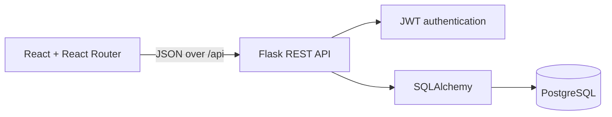

# Hackaform — Event Planning, Without the Chaos

[](https://github.com/Svnd3/hackaform/actions/workflows/ci.yml)

Hackaform is a deployment-ready full-stack event productivity platform for people who organize and attend hackathons, workshops, meetups, and community events. Visitors can discover opportunities, authenticated attendees can manage their own bookings, and organizers can publish events, build agendas, monitor capacity, review attendance, and open a private pre-event attendee circle from one workspace.

Phase 3 completes the original React discovery prototype with secure authentication, authorization, and user-owned data. Hackaform's React client communicates with its own Flask REST API and PostgreSQL database; passwords are hashed, protected requests use JWTs, and Flask enforces ownership for every event, agenda, and booking mutation. Authentication was introduced early during Phase 2, so the final phase focuses on verifying, testing, documenting, and deploying that security boundary rather than rebuilding the product.

## Why Hackaform exists

Useful Kenyan and East African events are often scattered across websites and group chats. Attendees lose time comparing incomplete posts and tracking plans manually; organizers repeat event details across tools and manage attendance in spreadsheets. Hackaform turns that fragmented process into a dependable flow:

1. Discover a relevant event.
2. Review its programme and remaining capacity.
3. Book one or more places.
4. Meet confirmed attendees in the host's private WhatsApp circle before arriving.
5. Manage the booking from a personal schedule.
6. Create and operate an event from the organizer studio.

## Phase 3 features

### Attendee experience

- Browse and search published events by keyword, category, location, date, and format.
- View event details, availability, organizer information, and an ordered agenda.
- Register, sign in, and restore a session with a bearer JWT.
- Create, read, update, and delete personal bookings.
- Keep persistent bookings in **My schedule**.
- Open an event's private attendee circle only while holding a confirmed booking.
- Save a separate browser-local shortlist before deciding to book.

### Organizer experience

- Create, read, update, publish, cancel, and delete owned events.
- Create, read, update, reorder, and delete related agenda items.
- Review attendee names, statuses, quantities, and confirmed capacity.
- Create, update, or remove a WhatsApp attendee-circle invite and download a branded group cover.
- Manage draft and cancelled listings privately.
- Receive clear validation, authorization, conflict, loading, empty, and error feedback.

### Data integrity and security

- Passwords are hashed and never returned by the API.
- Protected requests use `Authorization: Bearer <access_token>`.
- The API, not only the UI, enforces event, agenda, and booking ownership.
- Attendee-circle invite links are never included in public event JSON; Flask releases them only to the event owner or a confirmed attendee.
- Anonymous visitors are redirected away from personal workspaces, and protected API routes reject missing, invalid, or expired tokens.
- Database constraints prevent duplicate user/event bookings and invalid quantities.
- PostgreSQL row locking and server-side checks protect event capacity.
- Agenda times must remain inside their parent event.
- Structured JSON errors provide stable codes, readable messages, and field details.

## Architecture



The relational model is:

- A **User** owns many **Events**.
- An **Event** contains many **AgendaItems**.
- A **User** makes many **Bookings**.
- A **Booking** belongs to one User and one Event.
- An **EventCircle** belongs to exactly one Event and stores its private coordination invite.

See the complete [ERD and integrity rules](docs/ERD.md), the [Phase 3 pitch](docs/PHASE3_PITCH.md), and the [final presentation demo guide](docs/PHASE3_DEMO.md).

## Technology

| Layer | Tools |
| --- | --- |
| Client | React 19, React Router, Vite, JavaScript, CSS, Lucide icons |
| API | Flask, Flask-SQLAlchemy, Flask-Migrate, Flask-JWT-Extended, Flask-CORS |
| Data | PostgreSQL 16, SQLAlchemy, Alembic migrations |
| Quality | Vitest, Testing Library, Pytest, pytest-cov, Ruff, Oxlint, GitHub Actions |
| Runtime | Gunicorn and Docker Compose |

## Live deployment

- Frontend: [hackaform-ten.vercel.app](https://hackaform-ten.vercel.app)
- API: [hackaform-api-svnd3.onrender.com/api](https://hackaform-api-svnd3.onrender.com/api)
- Health check: [hackaform-api-svnd3.onrender.com/api/health](https://hackaform-api-svnd3.onrender.com/api/health)

The repository includes a Render Blueprint that can reproduce both the Flask web service and PostgreSQL database on explicit free plans, generate production secrets, apply Alembic migrations, and load repeatable demonstration data. Deploy a new copy with:

[](https://render.com/deploy?repo=https://github.com/Svnd3/hackaform)

Vercel proxies `/api/*` to the Render service, so the browser keeps a same-origin API URL and no public database credentials are exposed. After accepting the Blueprint, wait for both Render resources to become available and redeploy the latest `main` commit on Vercel if it has not already rebuilt automatically. A free Render service can sleep after inactivity, so its first request may take about a minute. Free-tier database retention can change; verify the current Render terms before a later showcase.

## Project structure

```text
hackaform/
├── src/                    React pages, components, state, and API services
├── server/
│   ├── app/
│   │   ├── models/         User, Event, AgendaItem, Booking, EventCircle
│   │   ├── routes/         Auth and REST blueprints
│   │   └── seed.py         Repeatable demo data
│   ├── migrations/         Alembic schema history
│   ├── tests/              API, model, auth, and ownership tests
│   └── docker-compose.yml  PostgreSQL + Flask services
├── docs/                   Phase 3 pitch, ERD, demo, reflection, and checklists
└── .github/workflows/      Frontend and backend CI
```

## Local setup

### Prerequisites

- Node.js 22.12 or newer
- Python 3.12 or newer
- PostgreSQL 16, or Docker with Compose

### 1. Clone and install the React client

```bash
git clone git@github.com:Svnd3/hackaform.git
cd hackaform
npm install
```

### 2. Start PostgreSQL

The included Compose file starts PostgreSQL with the development credentials already reflected in `server/.env.example`.

```bash
cd server
docker-compose up -d database
```

If your Docker installation uses the newer plugin, run `docker compose up -d database` instead.

### 3. Configure and run Flask

```bash
cp .env.example .env
python3 -m venv .venv
source .venv/bin/activate
pip install -r requirements-dev.txt
flask --app run.py db upgrade
flask --app run.py seed
flask --app run.py run --debug
```

Change `JWT_SECRET_KEY` before any shared or production deployment. The API runs at `http://127.0.0.1:5000`.

### 4. Run React

In a second terminal, from the repository root:

```bash
npm run dev
```

Open `http://127.0.0.1:5173`. Vite proxies local `/api` traffic to Flask. For a separately hosted API, set:

```bash
VITE_API_BASE_URL=https://your-api.example.com/api
```

### Full Docker option

To build Flask and PostgreSQL together:

```bash
cd server
docker-compose up --build
docker-compose exec api flask --app run.py seed
```

## Demo accounts

After `flask --app run.py seed`:

| Role | Email | Password |
| --- | --- | --- |
| Organizer | `organizer@hackaform.test` | `DemoPass123` |
| Attendee | `attendee@hackaform.test` | `DemoPass123` |

The deterministic seed creates two users, one published event, two agenda items, and one confirmed booking. These public credentials are for demonstration only. Use a unique account for normal use, and never reuse the demo password elsewhere. Use `flask --app run.py seed --reset` only on disposable local data to restore the demo state.

## REST API

All responses use `{"data": ...}`; paginated event collections also include `meta`. Failures use:

```json
{
  "error": {
    "code": "validation_error",
    "message": "Please correct the highlighted fields.",
    "fields": {
      "title": "This field is required."
    }
  }
}
```

| Method | Endpoint | Access | Purpose |
| --- | --- | --- | --- |
| `GET` | `/api/health` | Public | Health and database check |
| `POST` | `/api/auth/register` | Public | Create account and return JWT |
| `POST` | `/api/auth/login` | Public | Authenticate and return JWT |
| `GET` | `/api/auth/me` | Authenticated | Restore current user |
| `GET` | `/api/events` | Public | Search/filter published events |
| `GET` | `/api/events?mine=true` | Authenticated | List the organizer's events |
| `POST` | `/api/events` | Authenticated | Create an event |
| `GET` | `/api/events/:id` | Public/owner | Read an event and agenda |
| `PATCH/DELETE` | `/api/events/:id` | Event owner | Update or delete an event |
| `GET/POST` | `/api/events/:id/agenda-items` | Owner for writes | List or create agenda items |
| `GET/PATCH/DELETE` | `/api/agenda-items/:id` | Event owner | Read, update, or delete an agenda item |
| `GET/POST` | `/api/bookings` | Authenticated | List personal bookings or create one |
| `GET/PATCH/DELETE` | `/api/bookings/:id` | Booking owner | Read, update, or delete a booking |
| `GET` | `/api/events/:id/bookings` | Event owner | Review an event's attendee roster |
| `GET` | `/api/events/:id/circle` | Event owner / confirmed attendee | Read the private attendee circle |
| `POST` | `/api/events/:id/circle` | Event owner | Create an attendee circle |
| `PATCH/DELETE` | `/api/events/:id/circle` | Event owner | Update or remove an attendee circle |

Event queries support `search`, `category`, `city`, `format`, `status`, `page`, and `perPage`.

## Quality checks

Run the complete client check:

```bash
npm run check
```

Run the backend suite:

```bash
cd server
source .venv/bin/activate
ruff check .
pytest --cov=app --cov-report=term-missing
flask --app run.py db check
```

The suites cover routing, authentication state, API normalization, controlled forms, CRUD flows, validation, expired and malformed tokens, cross-user access, capacity conflicts, and health behaviour. GitHub Actions repeats frontend lint/tests/build and backend Ruff/tests on pushes and pull requests to `main`. See the current workflow run for the authoritative test count and result.

## Design decisions

- **Extend, do not restart:** the Phase 1 component system, routes, filters, accessibility work, and saved-event feature remain in use; Phase 2 supplied the API and database; Phase 3 hardens authentication and user ownership.
- **Owned data first:** the custom API is the source of truth for events, agendas, users, capacity, and bookings.
- **Four meaningful related resources:** Event, AgendaItem, Booking, and EventCircle each support a complete lifecycle.
- **Server-side ownership:** hidden buttons are useful UX, but authorization is always enforced in Flask.
- **Private connection, deliberate handoff:** Hackaform controls who may retrieve an attendee-circle invite; WhatsApp remains responsible for the group itself.
- **Focused MVP:** payments, email reminders, waitlists, calendar sync, and AI recommendations are deferred until the core workflows are dependable.

## Challenges and known limitations

- The Phase 1 external sources used different schemas; the full-stack extension required a stable owned event contract while preserving the existing card and filter UI. A normalization boundary in `src/services/eventsApi.js` keeps components decoupled from transport details.
- Concurrent booking requests require more than a client-side counter, so capacity validation runs in Flask inside a locked transaction.
- Date/time inputs are submitted as ISO 8601 values and stored in UTC while each event keeps its display timezone.
- JWTs expire after 12 hours and are stored in browser local storage for this classroom MVP. Signing out removes the local token, while Flask still validates every protected request. A higher-risk production deployment should use short-lived access tokens with secure, `HttpOnly` refresh-token cookies, rotation, and revocation.
- The catalogue currently loads up to 60 events into client-side filters; server-driven pagination or infinite scrolling is the next scale improvement.
- WhatsApp does not expose a supported public API for silently creating ordinary groups or setting their photos. The organizer creates the group in WhatsApp, pastes its invite into Hackaform, and can download a branded cover to set manually.
- A WhatsApp invite is a shareable secret. Hackaform limits retrieval to confirmed attendees, but a member can still copy it; the organizer must revoke/reset the invite in WhatsApp if it escapes.
- Hackaform does not yet process payments, send reminders, upload image files, or provide waitlists.
- No blocking bugs are known in the documented MVP.


## License

This student capstone is provided for educational use. Event and account data in the seed are fictional.
