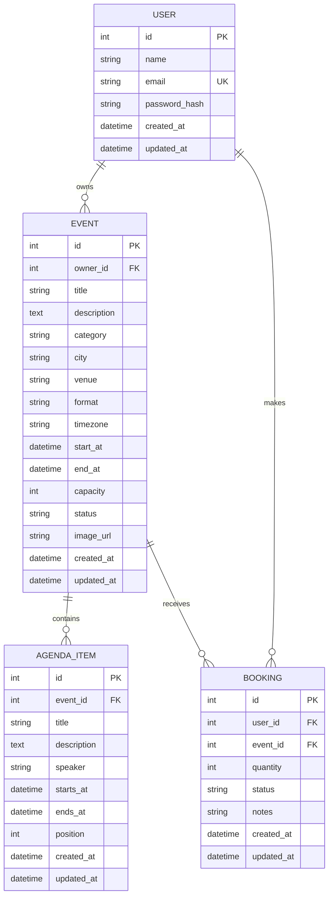

# Hackaform Phase 3 — Entity Relationship Diagram

Hackaform's final capstone data model combines persistent relational data with authenticated ownership. A user can organize events and attend other users' events. Every event can have an ordered agenda and many attendee bookings.

## Resource responsibilities

| Resource | Purpose | Relationship and ownership |
|---|---|---|
| `User` | Stores an attendee or organizer identity and password hash | Owns zero or more events and bookings |
| `Event` | Stores a discoverable listing, schedule boundary, publication state, and capacity | Belongs to one owner; contains agenda items; receives bookings |
| `AgendaItem` | Stores one ordered session in an event programme | Belongs to exactly one event and is managed by that event's owner |
| `Booking` | Stores an attendee's reservation, quantity, status, and note | Belongs to one user and one event; managed by that user |

## Integrity and authorization rules

- `users.email` is unique; passwords are stored only as hashes.
- Deleting a user cascades to that user's events and bookings.
- Deleting an event cascades to its agenda items and bookings.
- `(bookings.user_id, bookings.event_id)` is unique, so one user cannot create duplicate bookings for the same event.
- Event capacity must be positive; a confirmed booking quantity must be from 1 to 10 and cannot exceed the remaining places.
- An event must end after it starts. Every agenda item must end after it starts and fit within its event's dates.
- Event format is `in_person`, `online`, or `hybrid`; event status is `draft`, `published`, or `cancelled`; booking status is `confirmed` or `cancelled`.
- All mutations require a JWT. Only an event owner may change that event or its agenda, and only a booking owner may change that booking.

## CRUD coverage

| Resource | Create | Read | Update | Delete |
|---|---|---|---|---|
| Event | `POST /api/events` | `GET /api/events` and `GET /api/events/:id` | `PATCH /api/events/:id` | `DELETE /api/events/:id` |
| AgendaItem | `POST /api/events/:id/agenda-items` | `GET /api/events/:id/agenda-items` and `GET /api/agenda-items/:id` | `PATCH /api/agenda-items/:id` | `DELETE /api/agenda-items/:id` |
| Booking | `POST /api/bookings` | `GET /api/bookings` and `GET /api/bookings/:id` | `PATCH /api/bookings/:id` | `DELETE /api/bookings/:id` |

Protected requests send `Authorization: Bearer <access_token>`. This contract lets the React client use one owned API instead of the public feeds used in Phase 1.
