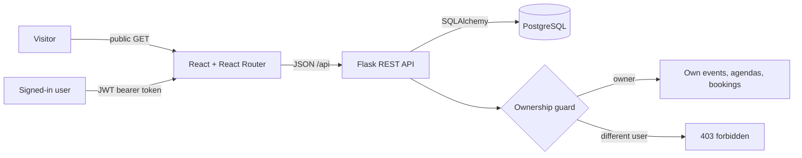

# Hackaform Phase 3 — Authentication and Production Readiness Pitch

**Product:** Hackaform

**Phase 3 objective:** Complete the existing React + Flask event platform with verified JWT authentication, server-enforced ownership, user-specific workspaces, and a dependable deployed experience.

**Planned timebox:** Two weeks / 10 working days (about 36 focused hours)

## Step 1: Business Problem Scenario

Kenyan and East African hackathons, workshops, meetups, and community events are often advertised across unrelated websites, social posts, and group chats. Students, early-career professionals, and community members repeatedly search for details, lose track of registrations, or miss an opportunity. Organizers duplicate the same information across tools and may manage programmes, capacity, and attendee lists manually. This is a productivity problem: both sides spend time coordinating information instead of participating in or running the event.

Hackaform creates one calm workflow for discovery, planning, and attendance. Visitors can browse published events without an account. After registering or signing in, attendees can create, view, update, and delete only their own bookings in **My schedule**. Any authenticated user can become an organizer by creating an event, then manage only the events and agenda items they own and review that event's attendee list. Phase 2 brought the authentication foundation forward; Phase 3 will audit and harden it, prove ownership at the API boundary, improve deployment readiness, and document the complete security story. The result saves planning time while ensuring one user's records cannot be changed by another.

### Goals and user stories

- As a visitor, I can browse and filter published events without surrendering personal data.
- As a new user, I can register and remain signed in while moving through protected pages.
- As an attendee, I can CRUD my bookings and see them persist in my personal schedule.
- As an organizer, I can CRUD my events and their agenda items and view attendance.
- As any signed-in user, I cannot read or mutate another user's private booking or manage an event I do not own.
- As a user, I receive useful loading, validation, empty, unauthorized, and network-error feedback.

## Step 2: Problem-Solving Process

### Access and data design

The relational model stays focused: `User` owns `Event` and `Booking`; `Event` contains `AgendaItem` and receives `Booking`. Event and AgendaItem provide related organizer CRUD, while Booking is a user-owned join resource with quantity, status, and notes. The API also protects capacity, unique user/event bookings, valid schedule times, and cascade behaviour. The complete model is in [ERD.md](./ERD.md).

### Seven-stage build and review process

1. **Define and audit:** map the Canvas rubric to user stories and audit the Phase 2 implementation instead of starting over.
2. **Model permissions:** document which routes are public, authenticated, event-owner-only, or booking-owner-only; add negative ownership cases.
3. **Harden authentication:** verify registration, password hashing, login, JWT expiry/error handling, session restoration, and sign-out behaviour.
4. **Verify protected CRUD:** exercise Event, AgendaItem, and Booking create/read/update/delete flows from React through Flask to PostgreSQL.
5. **Refine the client:** make auth state obvious, protect private routes, preserve accessible controlled forms, and handle all request states.
6. **Test and critique:** run automated suites, manually test two different users, request peer/instructor feedback, and correct confusing or unsafe behaviour.
7. **Deploy and document:** verify Vercel → Render → PostgreSQL requests in browser DevTools, update the README/endpoints, rehearse, record, and reflect.

### Tools, rationale, and likely challenges

React 19, React Router, and a shared API client keep navigation and auth state consistent. Flask blueprints separate auth, events, agendas, and bookings. Flask-JWT-Extended fits the separately deployed React and Flask services because each protected request carries a stateless bearer token. Werkzeug password hashing keeps raw passwords out of storage. SQLAlchemy, Alembic, and PostgreSQL provide relationships, constraints, migrations, and transactional capacity checks. Vitest/Testing Library, Pytest, Ruff, Oxlint, and GitHub Actions make the result repeatable.

The main risks are insecure direct-object access, stale/expired tokens, CORS or proxy errors after deployment, overbooking, and scope growth. Server-side ownership guards and negative tests address access control; centralized token/error handling addresses auth failures; a same-origin Vercel `/api` proxy and Render health check address deployment; database constraints and locked capacity checks protect data; and payments, chat, reminders, waitlists, image uploads, and AI recommendations remain out of scope. Research will focus on JWT security trade-offs, OWASP authorization guidance, Flask-JWT-Extended error handling, PostgreSQL locking, CORS, and Vercel/Render deployment behaviour.

## Step 3: Timeline and Scope

| Day | Work and estimate | Evidence / iteration point |
| --- | --- | --- |
| **1** | Reconfirm problem and rubric (1.5h); audit existing app (1.5h) | Prioritized user stories and Phase 3 gap list |
| **2** | Permission matrix, ERD review, API plan (2h); auth/UI wireflow (2h) | Review scope with lecturer or peer |
| **3** | Database constraints and migrations audit (2h); auth backend hardening (2h) | Register/login/me requests and negative cases pass |
| **4** | Event and agenda ownership routes/tests (4h) | Owner succeeds; different user receives `403` |
| **5** | Booking ownership, capacity, and validation routes/tests (4h) | Booking CRUD persists and cross-user access fails |
| **6** | React auth restoration, protected routes, and API integration (4h) | Refresh and sign-out behaviour verified |
| **7** | UX polish for forms/loading/empty/errors/responsiveness (3h) | Manual mobile and keyboard pass |
| **8** | Peer critique (1h); fix and regression testing (3h) | Record feedback, change, and retest |
| **9** | Deploy and verify Vercel, Render, PostgreSQL, CORS, and Network panel (3h) | Deployed end-to-end CRUD succeeds |
| **10** | README/API docs (1.5h); reflection, recording, and rehearsal (1.5h) | Public repo and final evidence checklist complete |

**MVP:** register, login, session restoration, sign-out, protected React routes, PostgreSQL persistence, server-enforced ownership, full Event/AgendaItem/Booking CRUD, discovery/search, capacity validation, responsive request states, tests, documentation, and deployment. **Deferred:** payments, email verification, refresh-token rotation, waitlists, reminders, team organizer roles, messaging, calendar sync, and AI recommendations. The MVP is done when two different users can prove the ownership boundary, all checks pass, and the deployed UI produces the expected `200`, `201`, `204`, `401`, `403`, and `409` responses without exposing secrets.
