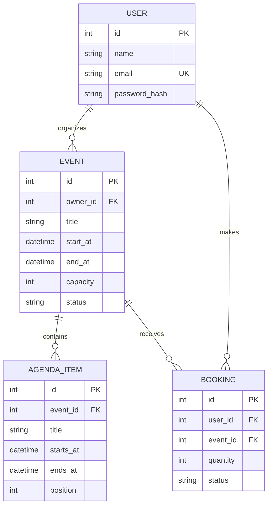

# Hackaform API

Hackaform's Phase 2 backend replaces the Phase 1 public event feeds with an owned REST API. Organizers can manage events and schedules; attendees can reserve places and manage their personal event plan. PostgreSQL is the production database, while the automated tests use isolated SQLite databases.

## Data model



`Event` and `AgendaItem` are related organizer-owned resources with full CRUD. `Booking` links users and events, adds another complete CRUD flow, prevents duplicate reservations, and checks capacity on the server. All write routes require a JWT. Event and agenda writes require event ownership; booking writes require booking ownership.

## Local setup

Requirements: Python 3.12+ and PostgreSQL 15+.

```bash
cd server
python3 -m venv .venv
source .venv/bin/activate
pip install -r requirements-dev.txt
cp .env.example .env
# Create the PostgreSQL database/user described by DATABASE_URL first.
flask --app run.py db upgrade
flask --app run.py seed
flask --app run.py run --debug --port 5000
```

Alternatively, start PostgreSQL and the API together with `docker compose up --build`, then run `docker compose exec api flask --app run.py seed` once.

The seed command creates:

- organizer: `organizer@hackaform.test` / `DemoPass123`
- attendee: `attendee@hackaform.test` / `DemoPass123`

For a quick local-only SQLite run, set `DATABASE_URL=sqlite:///hackaform.db`. Do not use SQLite in production.

## API contract

All endpoints are prefixed with `/api`. Protected requests use `Authorization: Bearer <accessToken>`. Successful responses use `{ "data": ... }`; paginated collections also have `meta`. The JSON contract uses camelCase so React can consume it directly. Failures consistently return:

```json
{
  "error": {
    "code": "validation_error",
    "message": "Human-readable explanation",
    "fields": { "field": "Specific guidance" }
  }
}
```

| Method | Endpoint | Access | Purpose |
|---|---|---|---|
| GET | `/api/health` | Public | Database-backed health check |
| POST | `/api/auth/register` | Public | Create an account and JWT |
| POST | `/api/auth/login` | Public | Exchange credentials for JWT |
| GET | `/api/auth/me` | User | Return current user |
| GET | `/api/events` | Public / optional auth | Published catalog; search, filter, paginate; `mine=true` for owner dashboard |
| POST | `/api/events` | User | Create an owned event |
| GET | `/api/events/:id` | Public / owner | Event detail with agenda |
| PATCH | `/api/events/:id` | Event owner | Update event |
| DELETE | `/api/events/:id` | Event owner | Delete event and related records |
| GET | `/api/events/:id/agenda-items` | Public / owner | List ordered agenda |
| POST | `/api/events/:id/agenda-items` | Event owner | Add agenda item |
| GET | `/api/agenda-items/:id` | Public / owner | Read agenda item |
| PATCH | `/api/agenda-items/:id` | Event owner | Update agenda item |
| DELETE | `/api/agenda-items/:id` | Event owner | Delete agenda item |
| GET | `/api/bookings` | User | List current user's bookings |
| POST | `/api/bookings` | User | Reserve event places |
| GET | `/api/bookings/:id` | Booking owner | Read booking |
| PATCH | `/api/bookings/:id` | Booking owner | Change quantity, notes, or status |
| DELETE | `/api/bookings/:id` | Booking owner | Permanently remove booking |
| GET | `/api/events/:id/bookings` | Event owner | View attendee roster |

`GET /api/events` supports `search`, `category`, `city`, `format`, `page`, and `perPage`. Authenticated organizers can use `mine=true&status=draft` to retrieve their private events.

Event JSON uses `ownerId`, `startAt`, `endAt`, `bookedSpots`, `availableSpots`, `imageUrl`, `createdAt`, `updatedAt`, and `agendaItems`. Booking requests use `eventId`; agenda requests use `startsAt` and `endsAt`.

Dates must be ISO 8601 strings with an offset, such as `2030-03-13T09:00:00+03:00`. They are stored and returned in UTC. Event formats are `in_person`, `online`, or `hybrid`; event statuses are `draft`, `published`, or `cancelled`; booking statuses are `confirmed` or `cancelled`.

## Migrations, seeds, and tests

```bash
flask --app run.py db upgrade
flask --app run.py seed --reset
pytest
pytest --cov=app --cov-report=term-missing
ruff check .
```

Create future model migrations with `flask --app run.py db migrate -m "describe change"`, inspect the generated file, and apply it with `flask --app run.py db upgrade`.

## Environment variables

| Variable | Required | Description |
|---|---:|---|
| `DATABASE_URL` | Production | PostgreSQL SQLAlchemy URL; legacy `postgres://` URLs are normalized automatically |
| `JWT_SECRET_KEY` | Production | Long random secret used to sign access tokens |
| `CORS_ORIGINS` | Yes | Comma-separated allowed React origins |
| `FLASK_DEBUG` | No | Set to `1` only for local development |

## Known limitations / Phase 3 opportunities

- Access tokens expire after 12 hours; refresh-token rotation and revocation are future work.
- Capacity is enforced server-side while locking the event row during PostgreSQL booking transactions. Multi-region deployments may additionally require a distributed reservation strategy.
- Payments, reminders, waitlists, organizer roles, and email verification are intentionally outside the Phase 2 MVP.
