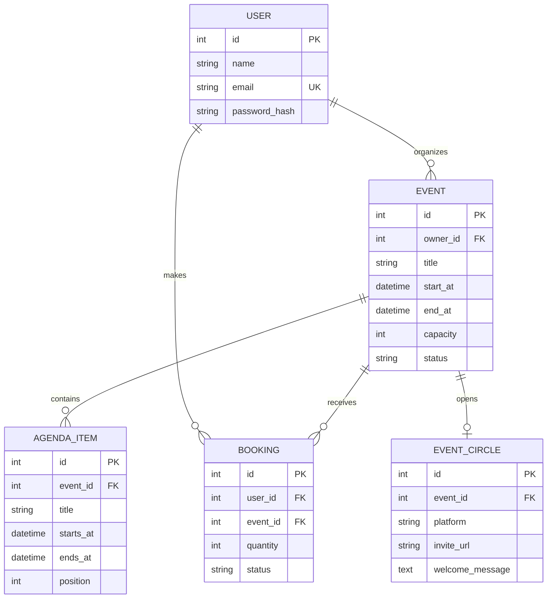

# Hackaform API — Phase 3

Hackaform's Flask API is the protected source of truth for the final capstone. It replaces the Phase 1 public feeds with owned data and completes the Phase 3 authentication and authorization layer. Organizers can manage their own events, agendas, and private attendee circles; attendees can reserve places, manage only their own bookings, and retrieve a circle invite only after confirmation. PostgreSQL is the production database, while automated tests use isolated SQLite databases.

## Data model



`Event` and `AgendaItem` are related organizer-owned resources with full CRUD. `Booking` links users and events, adds another complete CRUD flow, prevents duplicate reservations, and checks capacity on the server. `EventCircle` is a one-to-one child of Event: the organizer controls it, while only the organizer and confirmed attendees can read its private invite. All writes require a valid JWT. These checks run in Flask, so hiding a frontend control is never treated as authorization.

## Authentication and authorization

- `POST /api/auth/register` validates a unique normalized email, hashes the password, and returns the user plus a signed access token with HTTP `201`.
- `POST /api/auth/login` verifies the password hash and returns a fresh access token with HTTP `200`.
- `GET /api/auth/me` validates the token and restores the signed-in user.
- Protected routes resolve the token identity to a real user before accessing owned records.
- Missing, malformed, expired, or unknown-user tokens return structured errors rather than exposing data.
- Cross-user event, agenda, booking, and attendee-roster operations are rejected by server-side ownership guards.
- Circle invite URLs never appear in public event JSON and are returned only after an owner/confirmed-attendee authorization check.

Access tokens expire after 12 hours. The classroom client stores its token in local storage and removes it on sign-out. For a higher-risk public product, the next security iteration would add short-lived access tokens, refresh-token rotation in `HttpOnly` cookies, revocation, email verification, and authentication rate limiting.

## Local setup

Requirements: Python 3.12+ and PostgreSQL 15+.

```bash
cd server
python3 -m venv .venv
source .venv/bin/activate
pip install -r requirements-dev.txt
cp .env.example .env
# Create the PostgreSQL database/user described by DATABASE_URL first.
flask --app run.py db upgrade
flask --app run.py seed
flask --app run.py run --debug --port 5000
```

Alternatively, start PostgreSQL and the API together with `docker compose up --build`, then run `docker compose exec api flask --app run.py seed` once.

The seed command creates:

- organizer: `organizer@hackaform.test` / `DemoPass123`
- attendee: `attendee@hackaform.test` / `DemoPass123`

For a quick local-only SQLite run, set `DATABASE_URL=sqlite:///hackaform.db`. Do not use SQLite in production.

## API contract

All endpoints are prefixed with `/api`. Protected requests use `Authorization: Bearer <accessToken>`. Successful responses use `{ "data": ... }`; paginated collections also have `meta`. The JSON contract uses camelCase so React can consume it directly. Failures consistently return:

```json
{
  "error": {
    "code": "validation_error",
    "message": "Human-readable explanation",
    "fields": { "field": "Specific guidance" }
  }
}
```

| Method | Endpoint | Access | Purpose |
|---|---|---|---|
| GET | `/api/health` | Public | Database-backed health check |
| POST | `/api/auth/register` | Public | Create an account and JWT |
| POST | `/api/auth/login` | Public | Exchange credentials for JWT |
| GET | `/api/auth/me` | User | Return current user |
| GET | `/api/events` | Public / optional auth | Published catalog; search, filter, paginate; `mine=true` for owner dashboard |
| POST | `/api/events` | User | Create an owned event |
| GET | `/api/events/:id` | Public / owner | Event detail with agenda |
| PATCH | `/api/events/:id` | Event owner | Update event |
| DELETE | `/api/events/:id` | Event owner | Delete event and related records |
| GET | `/api/events/:id/agenda-items` | Public / owner | List ordered agenda |
| POST | `/api/events/:id/agenda-items` | Event owner | Add agenda item |
| GET | `/api/agenda-items/:id` | Public / owner | Read agenda item |
| PATCH | `/api/agenda-items/:id` | Event owner | Update agenda item |
| DELETE | `/api/agenda-items/:id` | Event owner | Delete agenda item |
| GET | `/api/bookings` | User | List current user's bookings |
| POST | `/api/bookings` | User | Reserve event places |
| GET | `/api/bookings/:id` | Booking owner | Read booking |
| PATCH | `/api/bookings/:id` | Booking owner | Change quantity, notes, or status |
| DELETE | `/api/bookings/:id` | Booking owner | Permanently remove booking |
| GET | `/api/events/:id/bookings` | Event owner | View attendee roster |
| GET | `/api/events/:id/circle` | Event owner / confirmed attendee | Read the private attendee circle |
| POST | `/api/events/:id/circle` | Event owner | Create the event's attendee circle |
| PATCH | `/api/events/:id/circle` | Event owner | Update the invite or welcome message |
| DELETE | `/api/events/:id/circle` | Event owner | Remove the attendee circle |

`GET /api/events` supports `search`, `category`, `city`, `format`, `page`, and `perPage`. Authenticated organizers can use `mine=true&status=draft` to retrieve their private events.

Event JSON uses `ownerId`, `startAt`, `endAt`, `bookedSpots`, `availableSpots`, `imageUrl`, `createdAt`, `updatedAt`, and `agendaItems`. Booking requests use `eventId`; agenda requests use `startsAt` and `endsAt`.

Event-circle requests use `inviteUrl` and optional `welcomeMessage`. The invite must be an HTTPS URL on the exact `chat.whatsapp.com` host. Hackaform cannot create a consumer WhatsApp group or set its photo through a supported public API; the organizer creates the group in WhatsApp, pastes its invite, and can use the client-generated cover as a manual setup aid.

Dates must be ISO 8601 strings with an offset, such as `2030-03-13T09:00:00+03:00`. They are stored and returned in UTC. Event formats are `in_person`, `online`, or `hybrid`; event statuses are `draft`, `published`, or `cancelled`; booking statuses are `confirmed` or `cancelled`.

## Migrations, seeds, and tests

```bash
flask --app run.py db upgrade
flask --app run.py seed --reset
pytest
pytest --cov=app --cov-report=term-missing
ruff check .
```

Create future model migrations with `flask --app run.py db migrate -m "describe change"`, inspect the generated file, and apply it with `flask --app run.py db upgrade`.

## Environment variables

| Variable | Required | Description |
|---|---:|---|
| `DATABASE_URL` | Production | PostgreSQL SQLAlchemy URL; legacy `postgres://` URLs are normalized automatically |
| `JWT_SECRET_KEY` | Production | Long random secret used to sign access tokens |
| `CORS_ORIGINS` | Yes | Comma-separated allowed React origins |
| `FLASK_DEBUG` | No | Set to `1` only for local development |

## Render deployment

The root `render.yaml` Blueprint provisions the API and PostgreSQL together on free plans. Its start command applies migrations, loads the idempotent seed, and then starts Gunicorn. From the repository page, use the **Deploy to Render** button in the main README and approve the two resources. The configured API hostname is `https://hackaform-api-svnd3.onrender.com`; Vercel forwards `/api/*` requests to it.

The Blueprint generates `SECRET_KEY` and `JWT_SECRET_KEY`, obtains `DATABASE_URL` directly from the managed database, and restricts cross-origin browser requests to `https://hackaform-ten.vercel.app`. Never run the seed command with `--reset` during startup because that would erase user-created records.

## Known limitations / future production hardening

- Access tokens expire after 12 hours; refresh-token rotation and revocation are future work.
- Capacity is enforced server-side while locking the event row during PostgreSQL booking transactions. Multi-region deployments may additionally require a distributed reservation strategy.
- A group invite can be copied by an authorized member. If it is shared outside the event, the organizer must revoke/reset it in WhatsApp and update Hackaform.
- Payments, reminders, waitlists, multi-user organizer teams, and email verification are intentionally outside the final capstone MVP.
